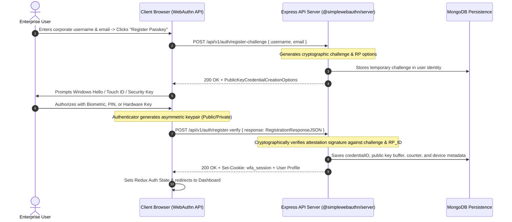

# WebAuthn / Passkey & FIDO2 Authentication Flow Specification

## 1. Overview & Zero-Trust Principles

The Workforce Analytics Platform relies on **FIDO2 WebAuthn / Passkeys** for passwordless, cryptographically verified enterprise authentication.

### Core Security Mandates:
- **Zero Password Storage**: The application provides no password input forms and stores zero passwords or hashes.
- **Biometric & PIN Privacy**: Fingerprints, FaceID scans, Windows Hello PINs, and private keys **never leave the user's physical device**. Only public keys, credential IDs, and signature counters are stored in MongoDB.
- **Phishing Resistance**: Challenges are cryptographically bound to the Relying Party ID (`RP_ID`), preventing adversary-in-the-middle phishing attacks.
- **Replay Protection**: Cryptographic signature counters are monotonically verified on every login.
- **No Tokens in LocalStorage**: Authentication sessions are secured via HttpOnly, encrypted cookies backed by MongoDB session storage.

---

## 2. End-to-End Sequence Diagrams

### A. Passkey Registration Ceremony



---

### B. Passkey Authentication (Login) Ceremony

```mermaid
sequenceDiagram
    autonumber
    actor User as Enterprise User
    participant Browser as Client Browser (WebAuthn API)
    participant Backend as Express API Server (@simplewebauthn/server)
    participant DB as MongoDB Persistence

    User->>Browser: Clicks "Sign In with Passkey / Security Key"
    Browser->>Backend: POST /api/v1/auth/login-challenge
    Note over Backend: Generates challenge & authentication options
    Backend-->>Browser: 200 OK + PublicKeyCredentialRequestOptions
    Browser->>User: Prompts Windows Hello / Touch ID / FIDO2 Key
    User->>Browser: Authorizes biometric / PIN
    Note over Browser: Authenticator signs challenge using stored Private Key
    Browser->>Backend: POST /api/v1/auth/login-verify { response: AuthenticationResponseJSON }
    Backend->>DB: Retrieves Public Key by credentialID
    DB-->>Backend: Passkey record (Public Key & Counter)
    Note over Backend: Cryptographically verifies signature & counter increment
    Backend->>DB: Updates counter & lastUsedAt timestamp; logs audit event
    Backend-->>Browser: 200 OK + Set-Cookie: wfa_session + User Profile
    Browser->>Browser: Establishes session & navigates to Dashboard
```

---

## 3. Platform & Hardware Compatibility Matrix

| Operating System | Supported Authenticators | Supported Browsers | Notes |
| :--- | :--- | :--- | :--- |
| **Windows 10 / 11** | Windows Hello (Fingerprint, Face, PIN), YubiKey USB/NFC | Chrome, Edge, Firefox, Brave | Windows Hello platform authenticator built-in. |
| **macOS (Ventura+)** | Touch ID, Apple Watch, YubiKey USB/NFC | Safari, Chrome, Edge, Firefox | Cross-device passkeys synced via iCloud Keychain. |
| **iOS / iPadOS (16+)** | Face ID, Touch ID, NFC Security Keys | Safari, Chrome | Hardware security key via Lightning/USB-C/NFC. |
| **Android (9+)** | Screen Lock (Fingerprint, Face, PIN), FIDO2 NFC | Chrome, Edge, Firefox | Google Password Manager syncs passkeys across devices. |
| **Linux** | YubiKey, Nitrokey, SoloKey USB/NFC | Chrome, Firefox, Chromium | Requires `libfido2` / `udev` rules for USB access. |

---

## 4. Audit Logging & Security Operations

All authentication events are logged into the `AuthAuditLog` collection in MongoDB:
- Event types: `register_challenge`, `register_success`, `register_failure`, `login_challenge`, `login_success`, `login_failure`, `logout`, `credential_rename`, `credential_revoke`.
- Audit metadata: `userId`, `username`, `ipAddress`, `userAgent`, `timestamp`, `failureReason`.
