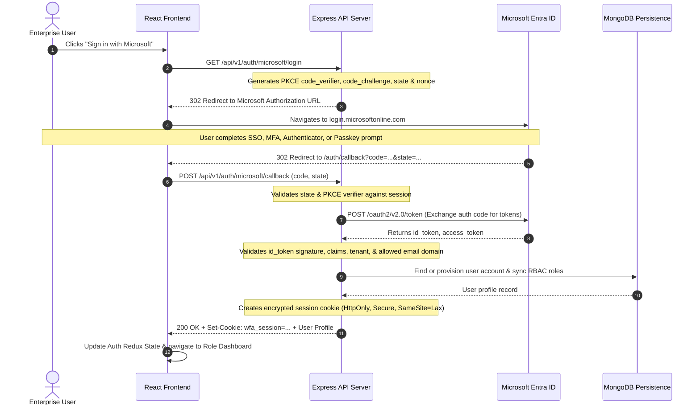

# Microsoft Entra ID Authentication Flow Specification

## 1. Overview & Zero-Trust Principles

The Workforce Analytics Platform relies strictly on **Microsoft Entra ID** (formerly Azure Active Directory) for enterprise identity and access management. 

### Core Security Mandates:
- **No Local Password Collection**: The application provides no password input forms and stores zero user passwords.
- **Passwordless & MFA Controlled by Microsoft**: All authentication factors (Windows Hello, FIDO2 Passkeys, Microsoft Authenticator, MFA push) are enforced directly within Entra ID.
- **No Tokens in LocalStorage**: Access tokens and refresh tokens are strictly held in secure, encrypted HTTP-only session cookies and backend memory; never in browser `localStorage` or `sessionStorage`.
- **Zero Mock Authentication**: No fake login states or simulated identities. The initial implementation provides the configuration-guarded Entra ID sign-in entry shell.

---

## 2. End-to-End Sequence Diagram

---

## 3. Configuration & Fallback States

When Microsoft Entra ID environment variables are not yet populated in `.env`:
- The frontend displays a clean, disabled SSO button shell indicating **"Microsoft Entra ID configuration pending"**.
- Direct API calls to auth endpoints return a descriptive JSON error explaining missing credentials.
- Zero local password fallback is allowed.
