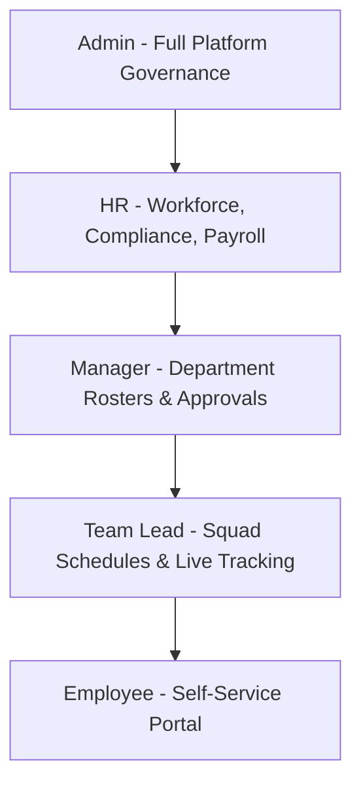

# Role-Based Access Control (RBAC) Specification

## 1. Overview

The Workforce Analytics Platform enforces a 5-tier hierarchical **Role-Based Access Control (RBAC)** architecture coupled with fine-grained permission tokens.

---

## 2. Enterprise Role Hierarchy

---

## 3. Comprehensive Permissions Matrix

| Domain Category | Permission Key | Admin | HR | Manager | Team Lead | Employee |
| :--- | :--- | :---: | :---: | :---: | :---: | :---: |
| **Employees** | `employee:view` | ✅ | ✅ | ✅ (Team) | ✅ (Squad) | ✅ (Self) |
| | `employee:create` | ✅ | ✅ | ❌ | ❌ | ❌ |
| | `employee:update` | ✅ | ✅ | ❌ | ❌ | ❌ |
| | `employee:delete` | ✅ | ❌ | ❌ | ❌ | ❌ |
| **Attendance** | `attendance:view` | ✅ | ✅ | ✅ (Team) | ✅ (Squad) | ✅ (Self) |
| | `attendance:manage` | ✅ | ✅ | ✅ (Team) | ✅ (Squad) | ❌ |
| | `attendance:clock` | ✅ | ✅ | ✅ | ✅ | ✅ |
| **Leave & Absence** | `leave:view` | ✅ | ✅ | ✅ (Team) | ✅ (Squad) | ✅ (Self) |
| | `leave:request` | ✅ | ✅ | ✅ | ✅ | ✅ |
| | `leave:review` | ✅ | ✅ | ✅ | ❌ | ❌ |
| **Scheduling** | `schedule:view` | ✅ | ✅ | ✅ | ✅ | ✅ (Self) |
| | `schedule:manage` | ✅ | ✅ | ✅ | ✅ | ❌ |
| | `schedule:swap` | ✅ | ✅ | ✅ | ✅ | ✅ (Self) |
| **Compliance** | `compliance:view` | ✅ | ✅ | ✅ (Dept) | ❌ | ❌ |
| | `compliance:review` | ✅ | ✅ | ❌ | ❌ | ❌ |
| **Payroll** | `payroll:view` | ✅ | ✅ | ❌ | ❌ | ✅ (Self) |
| | `payroll:manage` | ✅ | ✅ | ❌ | ❌ | ❌ |
| **Analytics & Reports**| `analytics:view` | ✅ | ✅ | ✅ (Dept) | ✅ (Squad) | ❌ |
| | `report:export` | ✅ | ✅ | ✅ | ❌ | ❌ |
| **Governance** | `audit:view` | ✅ | ❌ | ❌ | ❌ | ❌ |
| | `settings:manage` | ✅ | ❌ | ❌ | ❌ | ❌ |

---

## 4. Frontend UX Guards vs Backend Security Enforcement

- **Frontend Navigation Guards (`RequireRole`, `RequirePermission`)**:
  - Filter visible navigation sidebar items.
  - Intercept unauthorized URL entries and redirect to `/403 Access Denied`.
  - Disable buttons or hide action toolbars when permissions are missing.
- **Backend Authorization Middleware (`requirePermission`, `requireRole`)**:
  - Validates session permissions against every requested API endpoint.
  - Returns `403 Forbidden` JSON payload on violation regardless of client state.
