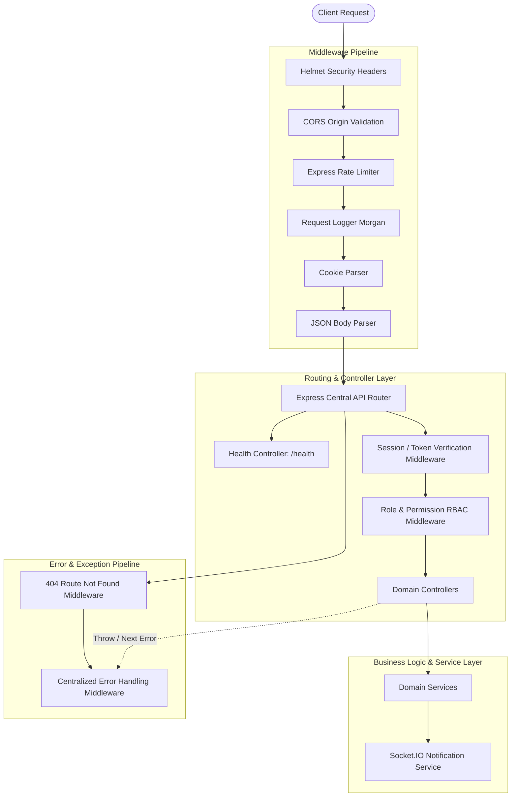

# Backend Architecture Specification

## 1. Overview

The Backend is engineered with **Node.js**, **Express**, and **TypeScript** in strict mode, adopting a layered architecture (Middleware $\rightarrow$ Controller $\rightarrow$ Service $\rightarrow$ Data Layer) and structured error handling.



---

## 2. Layer Definitions

1. **Config Layer (`src/config/`)**:
   - `env.config.ts`: Zod schema validation for all required and optional runtime environment variables. Throws descriptive errors if misconfigured.
   - `logger.ts`: Structured console and request logging.
2. **Middleware Layer (`src/middleware/`)**:
   - `security.middleware.ts`: Helmet headers, CORS policies with credentials support, and IP rate-limiting.
   - `request-logger.middleware.ts`: Morgan HTTP request logging with latency and status code tracking.
   - `not-found.middleware.ts`: Standard 404 API JSON response handler.
   - `error.middleware.ts`: Centralized error interceptor ensuring all internal errors return structured JSON:
     ```json
     {
       "success": false,
       "error": {
         "code": "INTERNAL_SERVER_ERROR",
         "message": "A system error occurred",
         "details": null
       }
     }
     ```
3. **Controller & Route Layer (`src/controllers/`, `src/routes/`)**:
   - Manages request input validation (via Zod schemas) and dispatches to business services.
4. **Realtime Socket Layer (`src/sockets/`)**:
   - Socket.IO server initialization, client connection lifecycle, room subscriptions (e.g. `department:engineering`, `role:manager`), and event broadcasting.

---

## 3. Graceful Lifecycle Management

The server manages startup and shutdown via signal handlers (`SIGTERM`, `SIGINT`):
- Closes incoming HTTP connections gracefully.
- Disconnects active WebSocket clients cleanly.
- Flushes logs before process termination.
