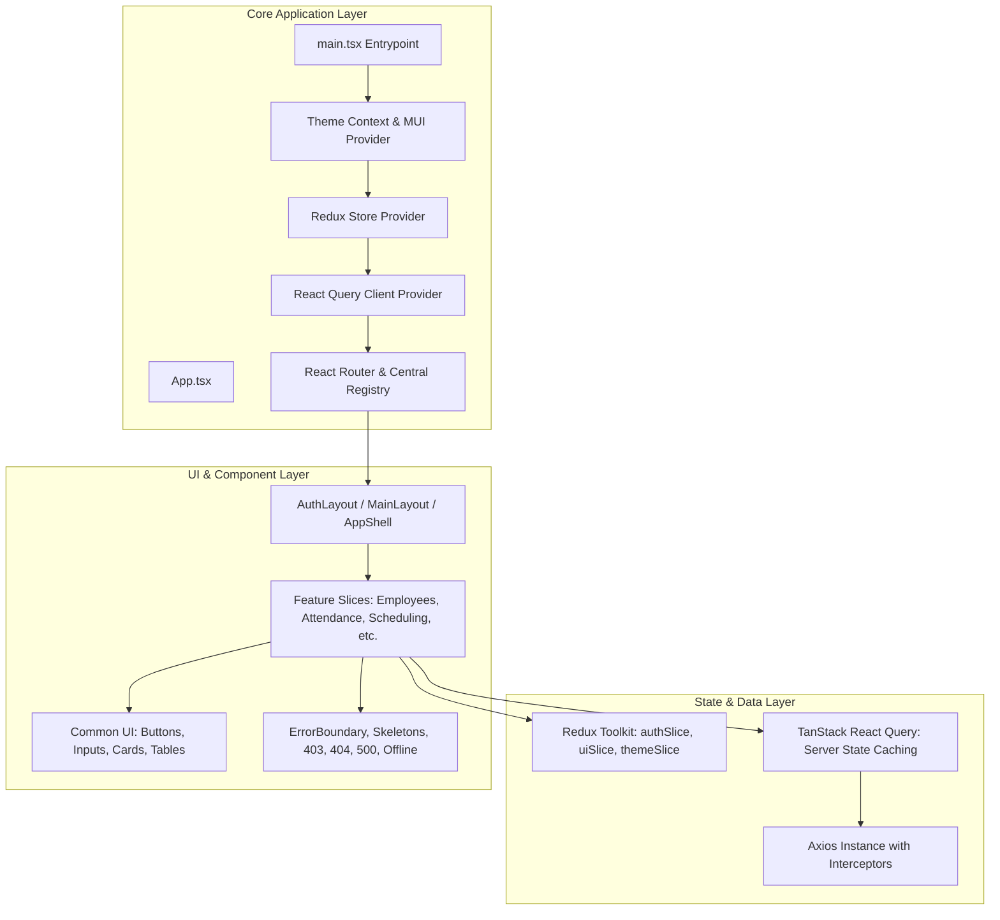

# Frontend Architecture Specification

## 1. Overview

The Frontend is built using **React 18+**, **TypeScript 5+** (Strict Mode), and **Vite**, organized into modular feature slices and a centralized design system.

---

## 2. Directory Structure & Layer Responsibilities

- `src/api/`: Centralized HTTP client configured with base URL, timeout, request interceptors (headers, trace IDs), and response interceptors (unified error handling, 401 redirect).
- `src/app/` & `src/store/`: Redux Toolkit store configuring slices for authentication state, UI state (sidebar open/collapse, mobile drawer), and theme mode.
- `src/auth/`: Entra ID types, authentication interfaces, and RBAC utility functions (`hasPermission`, `hasRole`).
- `src/components/`:
  - `common/`: Reusable primitive design system components (Buttons, Inputs, Select, Modal, Confirmation Dialog, Data Table Shell).
  - `feedback/`: ErrorBoundary, PageLoader, TableSkeleton, EmptyState, ErrorState, 403, 404, 500, OfflineState.
  - `layout/`: AppShell, Header, Sidebar, BreadcrumbNav, PageShell.
- `src/features/`: Isolated domain folders (`admin`, `analytics`, `attendance`, `compliance`, `employee`, `hr`, `manager`, `payroll`, `scheduling`, `team-lead`).
- `src/routes/`: Central route configuration (`route.config.ts`), `RequireAuth`, `RequireRole` route guards, and top-level router (`AppRoutes.tsx`).
- `src/theme/`: Design tokens (`tokens.ts`), light theme (`lightTheme.ts`), dark theme (`darkTheme.ts`), and ThemeProvider.

---

## 3. State Management Strategy

1. **Client UI State (Redux Toolkit)**:
   - Sidebar open/collapsed state
   - Visual theme preference (`light` | `dark` | `system`)
   - Active modals, notifications, and temporary layout state
2. **Server Cache State (TanStack React Query)**:
   - Automatic caching, deduplication, background re-fetching, and optimistic updates for REST endpoints.
3. **Authentication State**:
   - Session verification status, active user profile, assigned roles, and permission lists (managed via Redux + React Query).

---

## 4. Accessibility & Styling Standard

- Built on Material UI v5 with custom theme overrides following **WCAG 2.1 AA** guidelines.
- Color contrast ratio of $\ge 4.5:1$ for normal text and $\ge 3:1$ for large text/icons.
- Semantic HTML tags (`<nav>`, `<main>`, `<header>`, `<aside>`, `<section>`).
- Keyboard navigable with visible `:focus-visible` outlines.
- Clear `aria-label`, `aria-expanded`, and `aria-hidden` attributes on interactive elements.
