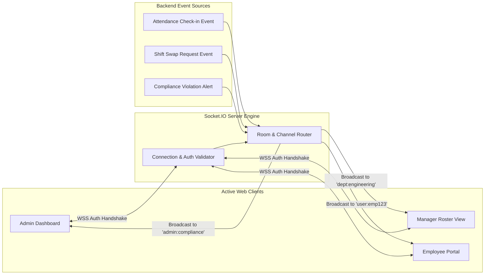

# Real-Time Event Architecture Specification

## 1. Overview

The Workforce Analytics Platform uses **Socket.IO** for low-latency bidirectional communication between the server and active client sessions.



---

## 2. Channel & Room Segmentation

| Room Pattern | Audience | Event Types |
| :--- | :--- | :--- |
| `global:system` | All connected enterprise clients | Maintenance alerts, system announcements |
| `role:admin` | System administrators | Critical compliance breaches, audit log alerts |
| `role:hr` | HR managers and staff | New onboardings, leave approvals pending |
| `dept:{departmentId}` | Department managers and team leads | Department attendance updates, shift rosters |
| `user:{userId}` | Targeted individual user | Shift swap approvals, direct notifications |

---

## 3. Standard Event Schemas

All real-time Socket payloads adhere to standard typed interfaces:

```typescript
interface SocketMessagePayload<T = unknown> {
  eventId: string;
  eventType: 'ATTENDANCE_UPDATE' | 'SHIFT_CHANGE' | 'COMPLIANCE_ALERT' | 'NOTIFICATION';
  timestamp: string;
  source: string;
  data: T;
}
```
