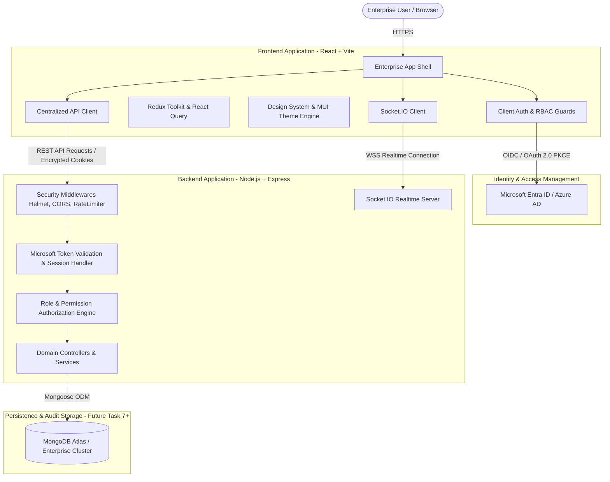

# System Architecture Specification

## 1. Overview

The **Workforce Analytics Platform (WFA)** is a multi-tier enterprise web application architected for resilience, security, role-based governance, and real-time operational telemetries.

---

## 2. Architectural Pillars

1. **Defense in Depth**:
   - Client-side navigation guards provide user experience routing.
   - Backend Express middlewares enforce strict identity validation, role verification, and permission validation on every API endpoint.
2. **Zero-Trust Identity**:
   - Zero password collection or storage within the application.
   - Microsoft Entra ID manages passwordless authentication, multi-factor authentication (MFA), and conditional access policies.
3. **Decoupled Monorepo Structure**:
   - Frontend and Backend projects operate independently with typed API contracts, shared schema validations via Zod, and clear folder boundaries.
4. **Resilient Feedback & Fault Tolerance**:
   - Centralized React Error Boundaries prevent blank screen lockups.
   - Global HTTP interceptors manage retry flows, 401 unauthenticated handoffs, 403 access rejections, and offline handling.
5. **Real-time Event Streaming**:
   - Socket.IO manages bi-directional telemetry for live shift rosters, attendance check-ins, and compliance alerts.

---

## 3. Communication Protocols

| Channel | Protocol | Security Mechanism | Purpose |
| :--- | :--- | :--- | :--- |
| **REST APIs** | HTTPS / JSON | HttpOnly, Secure, SameSite cookies / Bearer headers | Transactional data CRUD, reporting, analytics |
| **Identity & SSO** | HTTPS / OIDC PKCE | Cryptographic state & nonce, Microsoft Entra ID | User login, token exchange, SSO |
| **Realtime Telemetry**| WSS (WebSocket) | Handshake session cookie validation | Live rosters, audit logs, alerts |
